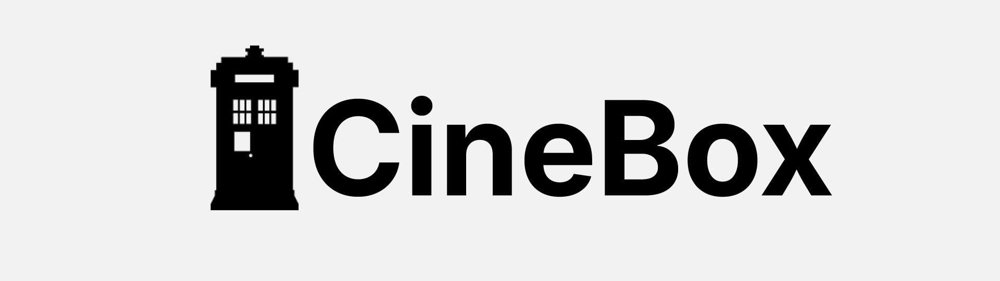
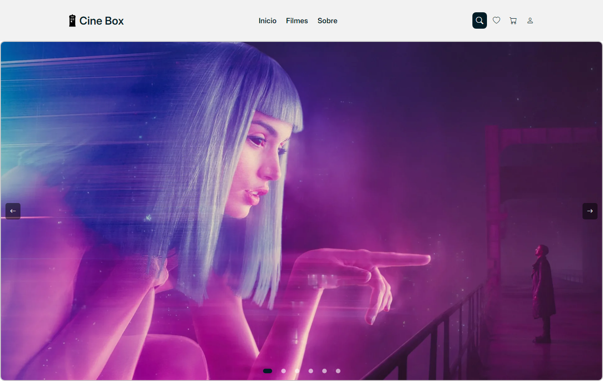

<h1 align="center">✨ CineBox </h1>

> Este repositório é dedicado para realização de um site de filmes CINEBOX para o aprendizado em criação de páginas web do curso TI24, proposto pelo docente [Paulo](https://github.com/paulowh). Aqui você encontrará informações, exemplos e recursos úteis para auxiliar no aprendizado de linguagem de programação e desenvolvimento web com HTML, CSS e JS.

<section align="center">
    <h2>✨ Linguagens & Tecnologias Usadas para o desenvolvimento desse repositório</h2>


    <br>


</section>

<div align="center">
    <h2>💻 Preview プレビュー</h2>
    
</div>

<h1 align="center">💻 Clonagem do repositório</h1>

Baixe e instale o [GIT](https://git-scm.com/)

```bash
# Clone esse repositório
git clone https://github.com/Downzin01/cineBox.git
```
```bash
# Vá para o repositório 
cd cineBox
```

<h1 align="center">💛 Contribuindo</h1>

> Gostaria de contribuir com suas próprias anotações ou recursos adicionais, sinta-se à vontade para fazer um fork deste repositório, adicionar suas contribuições e enviar um pull request. Sua colaboração é valorizada e pode ajudar outros alunos no aprendizado de JavaScript!

<section align='center'>
    <h3>💻 Contato 接触</h3>
    <p>
        <a href="mailto:dantasmatheus001@gmail.com">
            
        </a>
        <a href="https://www.instagram.com/downzin_" rel="nofollow">
            
        </a>
        <a href="https://x.com/DownloaderChan1" rel="nofollow">
            
        </a>
        <a href="https://discord.com/users/576935681167982595">
            
        </a>
    </p>
</section>


